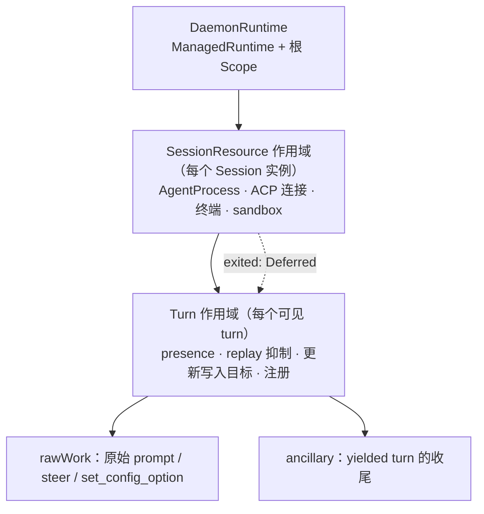

# 用 Effect 作用域重建 Turn 执行与 ACP 进程所有权

Status: proposed
Translation: current

[English](2026-09-27-effect-turn-execution-and-acp-process-ownership.md)

## 摘要

CLI 的 Turn 执行运行时与 ACP 子进程关停是近两个月生命周期缺陷最密集的区域：取消后所有权
提前释放、drain 等错对象、失败实例的事件终结了活动 turn、初始化无期限、Windows 残留子孙
进程。它们同属一类根因——资源或等待的生命周期没有绑定到拥有者，只能靠约 15 个布尔标志、
十余个按会话登记的 Map 和五份各不相同的 kill 实现维持。本提案把所有权改为三层 Effect
作用域（守护进程 → 会话资源 → turn）：进程与 ACP 连接由会话资源作用域获取和释放，原始 ACP
请求、steer、配置调用与收尾归 turn 作用域，停止原因以类型化值传给 finalizer，所有等待都有
上限并显式升级。计划分六个可独立回退的阶段交付，不改变 Stop/steer 的用户语义、历史格式
与 dispatch 指针规则；各阶段的预期收益尚未验证，Windows 进程树与"终止失败后是否隔离会话"
两项需要人工决定。

## 问题与证据

### 缺陷记录

| 根因类别 | 已修复实例 | 仍开放 |
| --- | --- | --- |
| 取消后所有权提前释放 / 原始请求比拥有者活得久 | #571、#618、#740（#477、#666）、#573、#847 | #738（待复现归因） |
| drain 等错对象 | #817（handoff steer 后 5 秒 SIGKILL） | — |
| 已脱离实例的事件终结活动 turn | #595、bounded-init 的两次评审修正 | stale-ACP 重试路径（未验证，见下） |
| 无期限等待 | #759（初始化挂 1h51m） | `killAndWait` 强制分支、taskkill 无期限 |
| 进程树未清理 | — | #429（Windows 子孙残留；#456/#457/#458 未合并即关闭） |

相关决策记录：[steer Stop 与恢复所有权](../../implemented/bug-fix/2026-09-16-steer-stop-recovery-ownership.zh.md)、
[有期限的会话初始化](../../implemented/bug-fix/2026-09-16-bounded-session-initialization.zh.md)、
[中断时待处理输入恰好一次](../../implemented/bug-fix/2026-09-14-interrupt-pending-input-exactly-once.zh.md)、
[失败创建的生命周期事件](../../implemented/bug-fix/2026-09-11-failed-session-create-lifecycle-events.zh.md)、
[原生压缩取消](../../implemented/bug-fix/2026-09-12-native-compaction-cancellation.zh.md)，以及仍为提案的
[Codex prompt 占用与恢复](../bug-fix/2026-09-10-codex-prompt-ownership-recovery.zh.md)。本提案实现后者
"AgentClient 持有真实请求直到结束"这一第一阶段结构，并把它推广到所有 turn 资源；不实现其第二阶段
（执行记录与恢复入口统一）。

### 代码现状（`HEAD` 963752f8）

执行服务 `apps/cli/src/session/session-execution-service.ts`（6890 行）：

- `TurnRuntimeState`（约 :270-318）用 `promptStarted`、`promptInFlight`、`finalizeStarted`、
  `finalizeCompleted`、`cancelRequested`、`cancelFinalized`、`interruptRequested`、
  `terminateSessionOnCancel`、`initializationStalled` 等标志，加上 `steerWaitController`、
  `cancellationDrain`、`pendingHandoffSteerOutcome`、`pendingSteerConfig`、`yieldedFinalization`
  promise 链来表达一个 turn 处于什么阶段、为什么结束。
- turn 的"活着"有三份事实：MessageHandler 的 `activeTurnId`（ACP 更新写入目标）、
  `currentTurnBySession`、`turnRuntimeBySession`；另有 `canceledTurnBySession`、
  `turnReleaseWaiters`、`initializationStallWaiters` 等登记表。
- turn 程序已经是一个 Effect（`runVisibleSessionTurn`，约 :3350-3730），但：
  - 用 `Effect.runFork(program)` 在默认运行时上启动根 fiber，守护进程关停时无法枚举或等待；
  - finalizer 靠 `Cause.isInterrupted` 加可变标志区分停滞、取消和中断（bounded-init 记录
    已说明直接中断会被误判为用户取消）；
  - `requestTurnInterrupt` 是 `void Effect.runPromise(Fiber.interrupt(fiber))`，不等 finalizer；
  - finalizer 内 `Effect.promise(() => yieldedFinalization)` 是无上限等待；
  - `drainCancelledPrompt` 在 Stop 路径以脱离作用域的 promise 运行，5 秒 `withTimeout` 后再
    检查"超时后是否刚好赢了"；
  - `finalizeTurn` 是 promise，Stop 中断 fiber 后它继续跑，只能在各阶段之间轮询
    `stopIfTurnCancelled`，并在发送完成通知前再查一次。
- `cancelSession`（约 :5666-5895）有八个分支，按 `promptInFlight`、`finalizeStarted`、
  是否有 runtime、ACP 是否就绪等组合决定是中断 fiber、发 ACP cancel 加后台 drain，
  还是直接调用 `finalizeCancelledTurn`。
- 文件后三分之一（约 :5897-6850）是机器级 ACP 认证、能力刷新和二进制安装，与 turn 无关。

`apps/cli/src/agent/agent-client.ts`（2997 行）：`pendingPrompts` Set 记录原始请求，
`pendingPromptCompletion` 暴露其 `allSettled`；`prompt()` 用 `Promise.race` 等原始请求或
AbortSignal，abort 时发 ACP cancel 并立即 reject；`steerPrompt` 用 `steerApplicationWaiters`
与多个 `void promise.then` 维护 applied/not-applied/unknown 三态。

进程层（`session.ts`、`session-sandbox.ts`、`acp-runner.ts`、`session-manager.ts`）：

- `Session.terminate` 不合并并发调用；`killAndWait` 只看 `exitCode`，不看 `signalCode`；
  强制分支 `await waitForExit()` 无上限；优雅分支 `Promise.race` 的 5 秒计时器从不清除。
- `sandbox.terminate` 失败被吞掉后仍 emit `terminated`；`terminated` 的 `exitCode` 取自
  exec 进程而不是 agent。
- Windows 下 Noop sandbox 用 `taskkill /T` 但忽略退出码、无期限，并使用缓存 PID；
  `acp-runner.ts` 的辅助进程在 Windows 上只 `child.kill` 外层 wrapper。
- ACP 根进程自行退出后，同进程组的后代不再被任何路径发信号。
- **ACP 进程意外死亡不产生任何事件**：`onExit` 只把 `agentProcess` 置空，`connection` 不关闭，
  `isCreated()` 仍为 true。SDK（`@agentclientprotocol/sdk` 1.3.0 `jsonrpc.js` `close()`）只在
  stdout 读到 EOF 时 reject 挂起请求；若孙进程仍持有管道，EOF 不会到来。
- `SessionManager` 的 `exit`/`terminated` 监听按 **id** 删除 `sessions[id]`，
  未 detach 的旧实例可以注销替代者；MessageHandler 收到 `terminated` 后以无 turnId 的
  `finalizeACPState(sessionId)` 收尾整个 turn。stale-ACP 重试路径（执行服务约 :4837）终止的是
  仍登记的旧实例，与 #595 同类，但尚未复现。
- 至少五份 SIGTERM→等待→SIGKILL 实现：`session.ts`、`acp-runner.ts`、`session-sandbox.ts`、
  `acp-authentication.ts` 状态探测、`packages/cli-supervisor`。

### Effect 已验证的行为（effect 3.18.4）

调研在同版本副本上用临时脚本实测（脚本已删除），结论决定了下文设计中的几个细节：

- `Scope.close(scope, exit)` 把 exit 传给每个 `acquireRelease` 的 release；以 `Exit.fail(reason)`
  关闭即可把类型化原因交给 finalizer。第二次 `Scope.close` 立即返回、不等第一次的 finalizer，
  因此"关闭"必须是一个被记忆化的共享操作，先到的原因胜出。
- `Effect.forkIn(effect, scope)` 的 fiber 在作用域关闭时被中断**并等待**；对不可中断的工作，
  关闭会等它真正结束。这正是"原始请求结束前不释放所有权"的结构化表达。
- `Effect.timeout` 作用在不可中断的工作上时会等工作结束；要"有上限地等"，必须把 timeout
  放在等待者上：`Fiber.await(raw).pipe(Effect.timeoutTo(...))`。
- `Fiber.interrupt` 等待 finalizer，`Fiber.interruptFork` 不等；`Effect.disconnect` 让工作
  在后台继续、调用方立即返回，语义上等于放弃所有权，本设计不用。
- `FiberMap.run` 同 key 替换时**不等待**旧 fiber 的 finalizer；需要"一个会话一个进程"时必须
  显式中断并等待，或用每 key 的 `Semaphore(1)` 串行。
- `ManagedRuntime.make(TestContext.TestContext)` 可以用 `TestClock.adjust` 驱动 `runFork`
  出去的 `sleep`，因此注入运行时就是时间测试的接缝；vitest 默认 fake timers 会冻结 Effect
  调度器（见现有测试只 fake `setInterval` 的做法）。
- `@effect/platform` 的 `Command` 在 POSIX 上 detached + 进程组 kill、Windows 上 `taskkill /T /F`，
  但释放时只 SIGTERM 然后无限等 `exit`，不升级、不设期限，并会合并 `process.env`；与
  "过滤环境变量启动子进程"的规则冲突，且需要锁定 0.92.x 或升级 effect。**不采用**，
  自建一层薄封装。

## 目标与非目标

目标：

1. 每个 turn 拥有的资源和异步工作都挂在 turn 作用域上；关闭作用域即释放，不存在"释放后仍在跑"
   的工作。
2. 每个 ACP 进程及其连接挂在会话资源作用域上；进程意外退出以类型化信号通知拥有它的 turn。
3. 停止原因（用户 Stop、Edit & Resend、访问撤销、初始化停滞、agent 退出、守护进程关停、
   已知失败）是一个类型化值，finalizer 按值分派，替代布尔标志。
4. 所有等待有上限，超限按明确策略升级（ACP cancel → 终止进程 → 报告终止失败），失败不被吞掉。
5. 过期实例的回调与事件在结构上无法触达新实例或新 turn。
6. 守护进程关停能枚举并按期限等待所有 turn 与进程。

非目标：

- 不改变 Stop、Guide/steer、Edit & Resend 的用户语义，不改变 `applied`/`not-applied`/`unknown`
  三态与 `pendingInput`/`prePromptSession` 策略。
- 不改变历史格式、`latestUserMsgId`/`lastHandledUserMsgId` 指针规则、队列提升规则。
- 不处理 CRDT 副本间的重复行（#1040 数据面部分）、ACP 适配器协议差异、跨重启的投递回执。
- 不在本提案内改造 dispatch watcher、MessageHandler 其余事件胶水、编排投递（见
  [迁移路线图](2026-09-27-effect-lifecycle-migration-roadmap.zh.md)）。

## 目标所有权模型



### DaemonRuntime

- 守护进程启动时创建一个 `ManagedRuntime`（初期 `Layer` 只含 Logger 与时钟），通过 deps
  注入 `SessionExecutionService`、`SessionManager`；测试注入基于 `TestContext` 的运行时。
- 所有 turn 以 `runtime.runFork(program, { scope: daemonScope })` 启动；关停按
  "所有 turn 以 `DaemonShutdown` 停止（有期限）→ 关闭会话资源 → MessageHandler 最终 flush →
  文档拆除"的顺序进行，保持 `session/AGENTS.md` 规定的两阶段 `cleanUp`。

### SessionResource

- `Session` 持有一个 `CloseableScope`。`createAgent` 在其中依次获取：start gate 许可
  （包住 spawn + initialize + newSession，保持默认并发 2 与 `LODY_MAX_CONCURRENT_ACP_SESSION_STARTS`）、
  `AgentProcess`、ACP 连接。
- `AgentProcess.acquire(spec)` = `Effect.acquireRelease(spawn, (proc, exit) => terminateTree(proc, policy(exit)))`，
  并提供 `exited: Deferred<ProcessExit>`（同时看 `exitCode` 与 `signalCode`，监听前先检查已退出）。
- 一个挂在会话资源作用域上的监视 fiber 等 `exited`：一旦完成，显式 `connection.close(AgentExited)`
  （不依赖 stdout EOF）、把客户端标为断开（`isCreated()` 为 false），并以 `AgentExited` 停止
  当前拥有该会话的 turn。
- `terminate` 被记忆化：并发调用共享同一次关闭，`terminated` 恰好发出一次，载荷取 agent 的退出信息；
  终止失败发出类型化的 `terminationFailed`，不再伪装成功。
- `SessionManager` 按实例订阅（订阅本身是会话资源作用域上的一个资源），不再按 id 删除。
  `pendingSessionCreates` 改为可中断的创建 fiber：放弃即中断，已获取的进程由作用域释放，
  bounded-init 记录里的"reaper"与 300 秒哨兵随之移除。

### Turn 作用域与 TurnSupervisor

每个可见 turn 由一个 `TurnHandle` 表示：

```ts
type TurnStopReason =
  | { _tag: 'UserStop'; pendingInput: 'promote' | 'preserve'; prePromptSession: 'discard' | 'keep' }
  | { _tag: 'Rewrite' }            // Edit & Resend：preserve / keep
  | { _tag: 'AccessRevoked' }      // preserve / discard
  | { _tag: 'InitStalled'; stall: SessionInitializationStall }
  | { _tag: 'AgentExited'; exit: ProcessExit }
  | { _tag: 'DaemonShutdown' }
  | { _tag: 'Halted'; reason: ChatFailedReason };

type TurnPhase = 'preparing' | 'prompting' | 'finalizing';

interface TurnHandle {
  readonly turnId: string;
  readonly scope: Scope.CloseableScope;
  readonly phase: Ref<TurnPhase>;
  readonly stopReason: Deferred<TurnStopReason>;   // 先到者胜出
  readonly released: Deferred<void>;              // 取代 turnReleaseWaiters
  readonly body: Fiber.RuntimeFiber<void, unknown>;
  readonly stop: (reason: TurnStopReason) => Effect<void>; // 记忆化
}
```

`stop(reason)` 只做两件事：把原因写进 `stopReason`，再按当前阶段处理：

| 阶段 | Stop 的效果 | 对应现状 |
| --- | --- | --- |
| `preparing`（创建、恢复、配置、打开条目） | 中断 `body` 并等待；创建中的 fiber 被中断，已获取的进程按 `prePromptSession` 决定是否释放 | `requestTurnInterrupt` + `terminateSessionOnCancel` |
| `prompting` | 发送 ACP cancel；所有本地等待（steer 等待、handoff 裁决等待）与 `stopReason` 竞速后结束；`body` 继续等原始 prompt 结束 | `requestAgentCancelInBackground` + `steerWaitController.abort()` |
| `finalizing` | 中断 `body`；后处理的每个阶段都是中断点，完成通知无需再查标志 | `finalizeStarted` 分支 + `stopIfTurnCancelled` |

turn 作用域关闭时的 release 按 `Exit` 中的原因分派，取代 `finalizeCancelledTurnEffect`、
`finalizeStalledInitializationEffect` 与 `awaitTurnFiber` 里的推断：

1. **drain**：`agentClient.awaitIdle` 带 5 秒上限（上限放在等待者上）；超限则以
   `DrainTimeout` 关闭会话资源（终止进程 → SDK reject 挂起请求 → rawWork 清空），再有上限地等一次。
2. **终止失败**：保持"终止失败不等于可复用"的现有规则。默认方案是 turn 继续持有所有权，
   但以可观测的 `release-blocked` 状态存在（有日志和诊断），而不是 finalizer 里的无上限 await；
   备选方案见"待决问题"。
3. **按原因写入**：`UserStop`/`Rewrite`/`AccessRevoked` 走现有取消写入顺序（先
   `markDispatchCancelled`，再暴露终态 assistant 条目）；`InitStalled` 与 `Halted` 走
   `recordKnownChatFailure`；`AgentExited` 走 `agent_disconnected` 分类；`DaemonShutdown`
   不写用户可见失败。
4. 释放 presence、replay 抑制、ACP 更新写入目标（MessageHandler 的 `activeTurnId` 改为本作用域
   上的 `acquireRelease`），完成 `released`。

原始 ACP 工作：`AgentClient` 成为唯一的底层占用边界，内部用连接级 `FiberSet` 持有每个原始
请求（prompt、steer 扩展请求、`set_config_option`），以 `Effect.uninterruptible` 包住请求本身——
它只能由 ACP 响应或连接关闭结束，不能被本地中断取消。对外提供 `awaitIdle(): Effect<void>`
与 `isIdle`。`pendingPrompts`、`pendingPromptCompletion`、`pendingSteerConfig`、
`cancellationDrain` 删除。

steer：

- `steerWaitController` 由"与 `stopReason` 竞速"取代；每次 steer 的裁决是一个
  `Deferred<SteerOutcome>`，handoff 的 `pendingHandoffSteerOutcome` 成为 turn 上的字段而非
  promise 链。
- `awaitPromptHandoffTail` 的 `Promise.race` 循环改写为 Effect 循环，`successorReady` 为
  `Deferred`；"handoff 裁决未到时不结束 steer 等待"的规则原样保留（#817）。
- `steerMutationQueue` 与 `steerStatusQueue` 先保留 `ConcurrentQueue`，第四阶段再改为
  TurnSupervisor 内每会话一个 `Semaphore(1)`。

`yieldedFinalization` promise 链改为 turn 作用域上的 `ancillary` `FiberSet`；release 时有上限地
join（超限记录日志、不阻塞释放）。初始化停滞由 watchdog 直接调用 `stop(InitStalled)`，
移除 `raceFirst` 与 `initializationStalled` 标志。

## 分阶段交付

每个阶段一个 PR，可独立回退，不改持久化格式。现有 `tests/session-execution-service.test.ts`
（9322 行）是行为契约：每个阶段都必须在不修改断言的前提下通过，只允许把计时脚手架换成
TestClock。

### 阶段 0：基础设施（无行为变化）

- 新建 `DaemonRuntime` 与测试运行时辅助；`runVisibleSessionTurn` 改为
  `runtime.runFork(program, { scope })`。
- 修正已知误用：`void runPromise(Fiber.interrupt)` 改为由 turn 作用域持有的中断 fiber
  （RPC 仍立即返回，释放由 `waitForTurnRelease` 观察）；`awaitTurnFiber` 用 `Cause.squash`
  保留原始错误；`Effect.promise(dispatchOptions.onTurnClaimed!)` 改为 `tryPromise`。
- 把 CLI `AGENTS.md` 引用但 OSS 仓库中缺失的 `context/cli-effect-ts.md` 补为
  `.agents/docs/cli-effect-ts.md`，写入本文"已验证的行为"中的边界规则，并修正链接。
- 决定是否引入 `@effect/vitest` 0.26.x（兼容 effect 3.18 与 vitest 3.2）。

完成标准：CLI 全量测试通过；关停时 `runtime.dispose()` 能等到所有 turn fiber。

### 阶段 1：进程树原语（直接对应 #429）

- 新增进程树模块（初期放在 `apps/cli/src/lib/process/`）：`spawnScoped`、`terminateTree`、
  `awaitExit`。规则：
  - 同时看 `exitCode` 与 `signalCode`；
  - POSIX 释放时**总是**向进程组发信号（ESRCH 视为已退出），即使根进程已先退出；
  - 宽限期后 SIGKILL，每次等待都有上限，计时器随等待结束清除；
  - Windows `taskkill /T` 检查退出码、设期限，失败再 `/F`，仍失败则返回类型化失败；
  - Linux cgroup 优雅路径宽限期后升级为 `cgroup.kill`；
  - 终止失败以类型化错误返回，由调用方决定，不在底层吞掉。
- 替换 `Session.killAndWait`、`acp-runner.ts` 的 `terminateChildProcess`、sandbox 的 kill 实现、
  `acp-authentication.ts` 状态探测的 kill；`cli-supervisor` 的实现在路线图中另行迁移。
- `Session.terminate` 记忆化、`terminated` 恰好一次且载荷正确、sandbox 终止失败不再报成功。

测试：伪进程 + TestClock 覆盖宽限、升级、超时、`signalCode` 退出、根先退出而组内后代存活；
注入平台与伪 `taskkill` 覆盖 Windows 分支；POSIX 真实进程测试用"子进程把孙进程 PID 写到 stdout"
作为显式就绪信号，断言关闭后孙进程不存在，不使用 sleep。

### 阶段 2：会话资源作用域与 agent 退出信号

- `Session` 持有 `CloseableScope`；start gate、进程、连接在其中获取；新增 `exited` 监视 fiber。
- `SessionManager` 按实例订阅；创建改为可中断 fiber；移除 reaper 与 300 秒哨兵。
- MessageHandler 的 `terminated`/`exit`/`error` 处理只在会话**没有**拥有者 turn 时收尾；
  有拥有者时由 turn 以 `AgentExited` 处理。这一步需同时修改 MessageHandler 与执行服务。
- 需要先验证：当前 SDK 在 `connection.close(error)` 后对 prompt 与扩展请求的 reject 行为，
  以及适配器孙进程持有 stdout 时的表现。

测试：agent 在 prompt 中途退出、在 steer 等待中退出、在初始化中退出；旧实例迟到的退出不影响
替代实例（沿用 bounded-init 的真实 `Session` 顺序用例）；放弃创建后进程被释放。

### 阶段 3：Turn 作用域与 TurnSupervisor（核心）

- 引入 `TurnHandle`、`TurnStopReason`、`TurnPhase`；删除上文列出的布尔标志与 promise 链。
- `AgentClient` 改为连接级 `FiberSet` + `awaitIdle`；drain 进入 release 并按上文升级。
- `finalizeTurn` 各阶段改为 Effect 步骤（`tryPromise` 传 signal）。
- 初始化停滞、agent 退出、守护进程关停都经由 `stop(reason)`。
- 多次 CRDT 写入必须原子完成的序列用 `Effect.uninterruptible` 包住，例如
  "取消标记先于终态 assistant 条目"、"墓碑与清除 steer 状态"。

测试：原有套件；新增按阶段 × 原因的矩阵（Stop 在 preparing/prompting/finalizing，
遇到 steer 已提交、handoff 裁决滞后、drain 超时且终止成功/失败、agent 退出）；对每个新机制做
消融，确认至少一个测试会因移除它而失败。

### 阶段 4：单一所有权登记与 cancelSession 简化

- `currentTurnBySession`、`turnRuntimeBySession`、`canceledTurnBySession`、`turnReleaseWaiters`、
  `initializationStallWaiters` 合并为 `TurnRegistry`；`waitForTurnRelease` = `Deferred.await(released)`。
- `cancelSession` 变为：取子任务控制分支 → 查 `TurnRegistry` → `handle.stop(UserStop{...})`；
  没有 runtime 时的"陈旧未完成 turn 修复"保留为显式的孤儿修复路径。
- steer 相关队列改为每会话 `Semaphore(1)`。

### 阶段 5：拆出机器级 ACP 操作

把认证、能力刷新、二进制安装（执行服务约 :5897-6850）移到独立服务，in-flight Map 改为
`RcMap`/`Deferred`。与 turn 无耦合，可与阶段 3/4 并行或延后。

## 必须保持的不变量

实施前逐条映射到测试，任何阶段不得改变：

- Stop 结束本地 steer 等待而不是拥有者；复用前 drain 原始 prompt/steer/配置工作，或确认终止。
- 已确认 steer 的结果只能是 `applied`/`not-applied`/`unknown`；只有适配器证据能判定
  `not-applied`；`unknown` 永不重放；handoff 适配器在 yielded prompt 应答之后才报告 `applied`。
- Stop 使用 `pendingInput: promote` / `prePromptSession: discard`；Edit & Resend 使用
  preserve/keep；访问撤销使用 preserve/discard。
- 取消结果先于终态 assistant 条目写入；没有 ACP 更新的 turn 走 `recordSilentTurnFailure`。
- 普通 turn 执行只写 `processingUserMsgId` 与 `lastHandledUserMsgId`。
- `SessionManager` 只为调用方拿到的实例发布生命周期事件。
- 远程 prompt 到达后，`agent.prompt` 之前只能等待正确性必需的准备（不新增等待）。
- 两阶段关停：先 `cleanUp({ keepWorkspaceDocumentOpen: true })`，最终 flush 后再 `cleanUp()`。

## 风险

- **中断点增多**：Effect 化后每个 `yield*` 都可能是中断点，两次 CRDT 写入之间被中断的窗口变多。
  缓解：显式列出必须原子的写入序列并包成不可中断区域。
- **混合期边界**：Promise 与 Effect 共存期间，`runPromise` 会把中断变成 `FiberFailure` 拒绝。
  规则：边界统一用 `runPromiseExit` 或 `Fiber.await` 显式映射；禁止在 Effect 内调用 `run*`；
  可拒绝的 promise 一律 `tryPromise({ try: (signal) => ... })`。
- **finalizer 中的等待**：finalizer 不可中断，任何无上限等待都会让关停卡死。所有 release 内的
  等待都必须带上限。
- **适配器差异**：handoff（内建 Claude）、同 turn steer（Codex）、合成压缩工具调用只能在真实
  适配器上完全验证；确定性测试只证明执行服务一侧的顺序。
- **两个最大文件同时修改**：阶段 2 需要 MessageHandler（9762 行）与执行服务一起改，评审成本高；
  以阶段划分控制单个 PR 规模。
- **测试替身扇出**：接口变化会波及约 95 个 Logger 替身；阶段 0 引入的运行时注入要避免新增
  必填依赖。
- **回退**：各阶段不改持久化格式，可单独 revert。不建议为阶段 3 保留新旧两套执行路径的开关，
  维护两份 6000 行级逻辑的成本高于风险；以现有套件、消融和按发布通道逐步放量替代。

## 待决问题（需要人工决定）

1. **Windows 进程树**：只做"验证过的 `taskkill /T`"，还是引入 Job Object（需要原生模块或
   辅助可执行文件，并影响打包）？阶段 1 默认只做前者。
2. **终止失败后的所有权**：保持 turn 持有直到原始请求结束（现状语义，阶段 3 默认），还是隔离该
   会话资源、允许用新进程继续（行为变化，需要 Spec 草案）？
3. 是否引入 `@effect/vitest`，以及是否统一改用 TestClock 替换现有只 fake `setInterval` 的写法。
4. `ancillary` 收尾的上限取值；当前没有测量数据。

## 验证边界

本记录只基于代码阅读、仓库历史、GitHub issue 与在 effect 3.18.4 上的临时脚本实测；没有实现，
也没有运行任何 CLI 测试。"修复 #429"及各类缺陷"在结构上不可再现"是设计目标，不是测量结果。
stale-ACP 重试路径的事件竞态、SDK 在孙进程持有管道时的关闭行为、Windows 行为均未验证。
